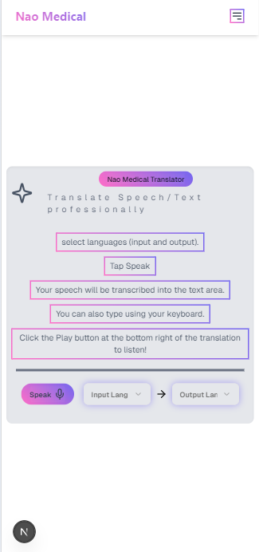

# Nao Medical Translator

The purpose of this demo is to showcase how you can build a Healthcare Translation Web App with Generative AI using NextJS + langchain + groq + vercel ai sdk + Web Speech API.

_Note that the Web Speech API's Speech recognition is broken on Android browsers due to a long-standing bug. Use iPhone or desktop instead._  
_You can confirm this on the [Demo Provided by Google](https://www.google.com/intl/en/chrome/demos/speech.html)_

## Quickstart

### Manual

Follow these steps to get started with this application.

#### Clone the repository

Go to GitHub and [clone the repository](https://github.com/Victoran0/nao-medical-translator).

#### Install dependencies

Install the project dependencies.

```bash
npm install --legacy-peer-deps
```

_`--legacy-peer-deps` because `shadcn` is not well updated with `react@19`_

#### Create environment variables

in the root folder, create a new file called `.env.local`.

```bash
GROQ_API_KEY=YOUR-GROQ-API-KEY
```

For `GROQ_API_KEY` paste in the key you generated in the [Groq console](https://console.groq.com/).

#### Run the application

Once running, you can [access the application in your browser](http://localhost:3000).

```bash
npm run dev
```

## Walkthrough

- Nao Medical Translator Landing page
  <br><br>
  
  <br><br><br>
- Click on the Menu icon on the upper right corner to toggle the menu
  <br><br>
  
  <br><br><br>
- Select desired Input and Output Language before starting the conversation
  <br><br>
  
  <br><br><br>
- Speech will be transcribed into the text area once input and output languages are set and the "Speak" button is clicked
  <br><br>
  
  <br><br><br>
- Let Nao Medical Translator do it's work
  <br><br>
  
  <br><br><br>
- When a translation is ongoing, the Speak button is disabled
  <br><br>
  
  <br><br><br>
- Click the play button on the bottom right of the translation to listen to it.
  <br><br>
  
  <br><br><br>
- While listening to a translation, click on the stop button to stop listening to it
  <br><br>
  
  <br><br><br>
- You can play any of the previous translations.
  <br><br>
  
  <br><br><br>
- When a translation is currently being played and you play another, the Translator stops speaking the previous.
  <br><br>
  
  
  <br><br><br>
- Responsive user interface irregardless of the screen size
  <br><br>
  
  <br><br>
  
  <br><br>
  
  <br><br>
  
  <br><br>
  
  <br><br>
  
  <br><br>
  
  <br><br>

## What tech stacks and libraries are used in this project?

- [Next.js](https://nextjs.org)
- [Tailwind CSS](https://tailwindcss.com)
- Langchain
- Shadcn-UI: For the UI components
- Meta Llama 4 scout via Groq: As the LLM Model
- Vercel AI sdk: To stream AI response
- motion: For interesting animations
- Sonner: To toast messages
- Lucide-react: For icons
- Zustand: For state Management across components

- etc

## Issue Reporting

If you have found a bug or if you have a feature request, please report them at this repository issues section. Please do not report security vulnerabilities on the public GitHub issue tracker.

## Getting Help

I will love to hear from you so if you have questions, comments or find a bug in the project, let me know! You can:

- [Open an issue in this repository](https://github.com/Victoran0/nao-medical-translator)

## Author

Victor Oluwadare
